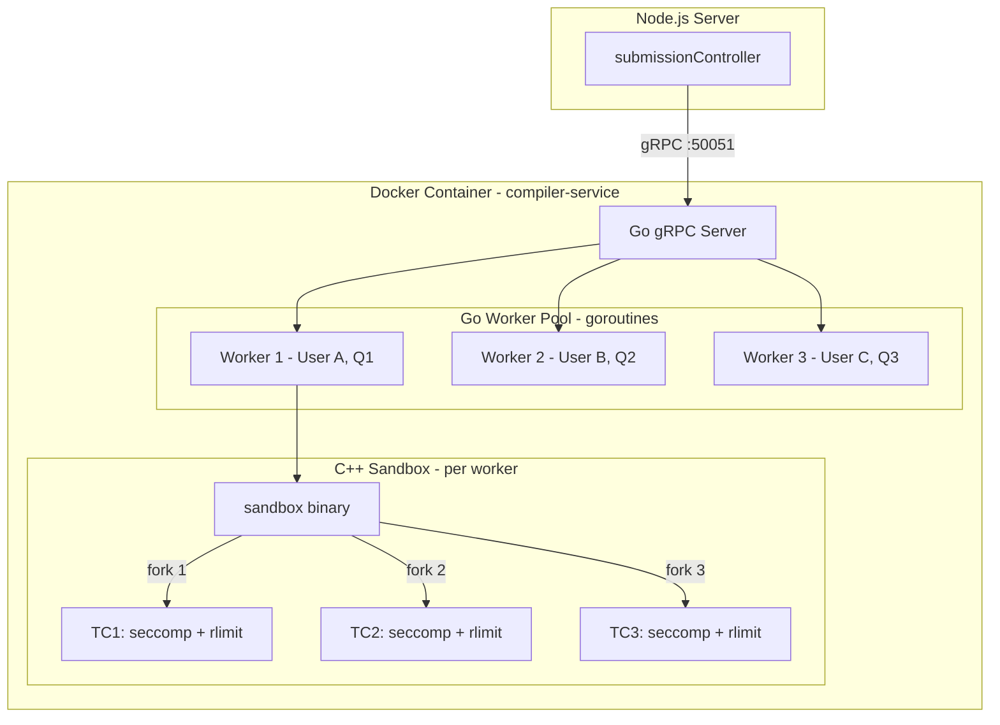
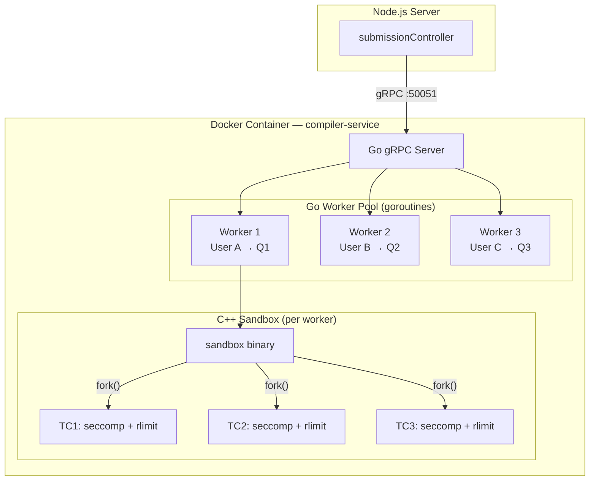

# Go + C++ Code Execution Microservice (gRPC)

## Bird's Eye View

The compiler service is a **self-contained black box**. From the outside, it has a single gRPC endpoint: send code in, get results out. Everything else — Docker containers, compilation, sandboxing, parallelism, resource enforcement — is handled **internally** by the service.

```
┌──────────────────────────────────────────────────────────────────┐
│                    COMPILER SERVICE (black box)                  │
│                                                                  │
│   INPUT (gRPC)                    OUTPUT (gRPC)                  │
│   ─────────────                   ──────────────                 │
│                                                                  │
│   • code: string                  IF compilation error:          │
│   • language: "c"|"cpp"|          • compilation_error: string    │
│              "java"|"python"                                     │
│   • test_cases: [                 IF compiled OK:                │
│       { input, expected },        • passed: int                  │
│       { input, expected },        • total: int                   │
│       ...                         • results: [                   │
│     ]                               { test_case, passed,         │
│                                       actual, expected,          │
│                                       runtime_ms, cpu_time_ms,   │
│                                       memory_kb, error }         │
│                                     ]                            │
│                                                                  │
│  ┌────────────────────────────────────────────────────────────┐  │
│  │          INTERNALS (caller never sees this)                │  │
│  │                                                            │  │
│  │  • Docker container lifecycle (managed internally)         │  │
│  │  • Go goroutine worker pool (concurrent submissions)       │  │
│  │  • C++ sandbox with fork() (parallel test cases)           │  │
│  │  • seccomp-bpf syscall filtering                           │  │
│  │  • rlimit memory/CPU enforcement                           │  │
│  │  • /proc-based metrics collection                          │  │
│  └────────────────────────────────────────────────────────────┘  │
└──────────────────────────────────────────────────────────────────┘
```

> **IMPORTANT:** The Node.js server **never touches Docker**. It only makes a gRPC call and receives structured results. All container orchestration, process isolation, and resource management are encapsulated within the compiler service.


---

## Architecture

A single Docker container running a **Go gRPC server** with a **C++ sandbox binary** for secure, parallel test case execution.




### Two-Level Parallelism

| Level | What | How | Controls |
|-------|------|-----|----------|
| **Level 1** | Concurrent submissions (users A, B, C) | Go goroutine worker pool (configurable, default: 4) | Queue depth, max workers |
| **Level 2** | Parallel test cases within one submission | C++ `fork()` — one child per TC | Per-child `seccomp-bpf`, `setrlimit`, `SIGKILL` on TLE |

**Example: 3 users, 3 questions, 3 TCs each:**
```
t=0ms   Go receives 3 gRPC requests
t=1ms   Worker 1,2,3 each pick up one submission
t=2ms   Each worker: compile user code (sequential)
t=500ms Each worker: call sandbox binary
t=501ms sandbox fork()s 3 children → 9 processes total
t=501ms All 9 test cases running simultaneously
t=600ms All results collected → 3 gRPC responses sent back
```

---

### Why gRPC (not HTTP, not raw TCP)

| | HTTP + JSON | gRPC + Protobuf | Raw TCP |
|---|---|---|---|
| Serialization | Text JSON | Binary protobuf (~10× smaller) | Custom binary |
| Transport | HTTP/1.1 | HTTP/2 (multiplexed) | Raw socket |
| Per-request overhead | ~1-5ms | ~0.3ms | ~0.02ms |
| Development time | Medium | Low (generated stubs) | High (build everything) |

**At 1000 concurrent users:**

| Aspect | Raw TCP | gRPC |
|---|---|---|
| Per-request overhead | ~0.02ms | ~0.3ms |
| Requests/sec capacity | ~50K–100K | ~30K–50K |
| Connection model | 1 socket, manual multiplexing | 1 HTTP/2 conn, auto-multiplex ~100 streams |
| Memory overhead | ~8KB total | ~1MB for 10 connections |
| Serialization | Custom binary protocol (you build it) | Protobuf (built-in, type-safe) |
| Message framing | Manual length-prefix/delimiters | Built-in |
| Error recovery | Manual reconnect, retry logic | Built-in backpressure, flow control, retries |
| Development time | Weeks (wire protocol + edge cases) | Days (generated stubs) |

**Decision:** Transport is **< 0.05%** of total time (compilation = 500ms–2s). At 1000 concurrent users, the bottleneck is CPU cores for compilation, not the wire protocol. gRPC gives type-safe, reliable communication. Raw TCP only matters at 50K+ users, where you'd add Kafka/Redis queuing anyway.

---

## Project Structure

```
compiler-service/
├── proto/
│   └── compiler.proto              # gRPC service definition
├── cmd/
│   └── sandbox/
│       └── sandbox.cpp             # C++ sandbox binary (~250 lines)
├── Dockerfile                      # Multi-stage: Go build + gcc + sandbox build
├── go.mod / go.sum
├── main.go                         # gRPC server entry
└── internal/
    ├── server/
    │   └── grpc.go                 # gRPC handler (Run, Compile, Health)
    ├── executor/
    │   ├── executor.go             # Compile → invoke sandbox → parse results
    │   ├── languages.go            # Language configs (C, C++, Java, Python)
    │   └── wrapper.go             # Auto-generate main() for LeetCode-style code
    └── pool/
        └── worker.go               # Goroutine worker pool with job queue
```

---

## Proto Definition (`compiler.proto`)

```protobuf
syntax = "proto3";
package compiler;
option go_package = "compiler-service/proto";

service CompilerService {
  rpc Run (RunRequest) returns (RunResponse);
  rpc Compile (CompileRequest) returns (CompileResponse);
  rpc Health (Empty) returns (HealthResponse);
}

message Empty {}

message TestCase {
  string input = 1;
  string expected = 2;
}

message TestCaseResult {
  int32  test_case = 1;
  string input = 2;
  string expected = 3;
  string actual = 4;
  bool   passed = 5;
  int64  runtime_ms = 6;
  int64  cpu_time_ms = 7;
  int64  memory_kb = 8;
  string error = 9;
}

message RunRequest {
  string code = 1;
  string language = 2;
  repeated TestCase test_cases = 3;
}

message RunResponse {
  string compilation_error = 1;
  int32  passed = 2;
  int32  total = 3;
  repeated TestCaseResult results = 4;
}

message CompileRequest {
  string code = 1;
  string language = 2;
}

message CompileResponse {
  bool   success = 1;
  string error = 2;
}

message HealthResponse {
  string status = 1;
}
```

---

## C++ Sandbox Binary (`sandbox.cpp`)

The core security + parallel execution engine. Called by Go as:
```
./sandbox --binary ./main --timeout 15000 --memory 256 --testcases tc.json
```

**What it does:**

```
Read tc.json (array of {input, expected})
    │
    ├── fork() child 1 → seccomp + rlimit → exec(binary < input1) → collect metrics
    ├── fork() child 2 → seccomp + rlimit → exec(binary < input2) → collect metrics
    └── fork() child 3 → seccomp + rlimit → exec(binary < input3) → collect metrics
    │
    waitpid() for all children
    │
    Print JSON results to stdout
```

**Per-child process isolation:**
- `seccomp-bpf`: whitelist only `read`, `write`, `mmap`, `brk`, `exit_group` (block `socket`, `fork`, `exec`, `open` outside /app)
- `setrlimit(RLIMIT_AS, memory_mb)` → kernel kills child if exceeded (MLE)
- `alarm(timeout_sec)` → SIGALRM kills child if exceeded (TLE)
- `clock_gettime(CLOCK_PROCESS_CPUTIME_ID)` → exact CPU time
- Read `/proc/[pid]/status` `VmHWM` → peak memory

**Output format (JSON to stdout):**
```json
[
  {"test_case":1, "exit_code":0, "stdout":"[0,1]\n", "stderr":"", "cpu_time_ms":8, "memory_kb":3400, "wall_time_ms":12, "signal":0},
  {"test_case":2, "exit_code":0, "stdout":"[1,2]\n", "stderr":"", "cpu_time_ms":5, "memory_kb":3200, "wall_time_ms":9, "signal":0},
  {"test_case":3, "exit_code":9, "stdout":"", "stderr":"", "cpu_time_ms":15000, "memory_kb":0, "wall_time_ms":15001, "signal":9}
]
```

---

## Go Execution Flow (`executor.go`)

```
gRPC RunRequest arrives
        │
        ▼
  Worker pool assigns goroutine
        │
        ▼
  ┌──────────────┐
  │ Write code   │  → /tmp/{uuid}/main.cpp
  │ Preprocess   │  → wrapper.go adds main() if needed
  └──────┬───────┘
         │
  ┌──────┴───────┐     YES
  │   Compile    │──────────► Return compilation_error
  │  (g++/javac) │  error?
  └──────┬───────┘
         │ NO
  ┌──────┴────────────┐
  │ Write tc.json     │
  │ Invoke: ./sandbox │
  │   --binary ./main │
  │   --testcases tc  │
  │   --timeout 15000 │
  │   --memory 256    │
  └──────┬────────────┘
         │
  Parse sandbox JSON stdout
         │
  Compare actual vs expected
         │
  Return RunResponse via gRPC
```

---

## Changes to Node.js Server

### `dockerRunner.ts` → gRPC Client

Replace all Docker/subprocess code with a gRPC client (~30 lines):

```typescript
import * as grpc from '@grpc/grpc-js';
import * as protoLoader from '@grpc/proto-loader';

const PROTO_PATH = path.resolve(__dirname, '../../../compiler-service/proto/compiler.proto');
const COMPILER_ADDR = process.env.COMPILER_SERVICE_ADDR || 'localhost:50051';

const packageDef = protoLoader.loadSync(PROTO_PATH);
const proto = grpc.loadPackageDefinition(packageDef).compiler as any;
const client = new proto.CompilerService(COMPILER_ADDR, grpc.credentials.createInsecure());

export function runWithTestCases(code, language, testCases): Promise<TestCaseRunResult> {
  return new Promise((resolve, reject) => {
    client.Run({ code, language, test_cases: testCases }, (err, response) => {
      if (err) return reject(err);
      resolve({ /* map response fields */ });
    });
  });
}
```

### Other Changes
- **Delete** `cppWrapper.ts` — logic moves to Go `wrapper.go`
- **Update** `docker-compose.yml` — add compiler-service on port 50051
- **Install** `@grpc/grpc-js` + `@grpc/proto-loader` in Node.js server

---

## Verification Plan

1. Build Docker image, confirm gRPC health check
2. Submit correct C++ code → all TCs pass, metrics returned
3. Submit code with syntax error → `compilation_error` returned
4. Submit infinite loop → TLE detected per TC
5. Submit massive malloc → MLE detected per TC
6. Submit 3 concurrent requests → all handled in parallel
7. End-to-end: Node.js → gRPC → compiler → UI renders results


<br><br>
# Go + C++ Code Execution Microservice (gRPC)

## Bird's Eye View

The compiler service is a **self-contained black box**. From the outside, it has a single gRPC endpoint: send code in, get results out. Everything else — Docker containers, compilation, sandboxing, parallelism, resource enforcement — is handled **internally** by the service.

```
┌──────────────────────────────────────────────────────────────────┐
│                    COMPILER SERVICE (black box)                  │
│                                                                  │
│   INPUT (gRPC)                    OUTPUT (gRPC)                  │
│   ─────────────                   ──────────────                 │
│                                                                  │
│   • code: string                  IF compilation error:          │
│   • language: "c"|"cpp"|          • compilation_error: string    │
│              "java"|"python"                                     │
│   • test_cases: [                 IF compiled OK:                │
│       { input, expected },        • passed: int                  │
│       { input, expected },        • total: int                   │
│       ...                         • results: [                   │
│     ]                               { test_case, passed,         │
│                                       actual, expected,          │
│                                       runtime_ms, cpu_time_ms,   │
│                                       memory_kb, error }         │
│                                     ]                            │
│                                                                  │
│  ┌────────────────────────────────────────────────────────────┐  │
│  │          INTERNALS (caller never sees this)                │  │
│  │                                                            │  │
│  │  • Docker container lifecycle (managed internally)         │  │
│  │  • Go goroutine worker pool (concurrent submissions)       │  │
│  │  • C++ sandbox with fork() (parallel test cases)           │  │
│  │  • seccomp-bpf syscall filtering                           │  │
│  │  • rlimit memory/CPU enforcement                           │  │
│  │  • /proc-based metrics collection                          │  │
│  └────────────────────────────────────────────────────────────┘  │
└──────────────────────────────────────────────────────────────────┘
```

> [!IMPORTANT]
> The Node.js server **never touches Docker**. It only makes a gRPC call and receives structured results. All container orchestration, process isolation, and resource management are encapsulated within the compiler service.

---

## Architecture

A single Docker container running a **Go gRPC server** with a **C++ sandbox binary** for secure, parallel test case execution.



### Two-Level Parallelism

| Level | What | How | Controls |
|-------|------|-----|----------|
| **Level 1** | Concurrent submissions (users A, B, C) | Go goroutine worker pool (configurable, default: 4) | Queue depth, max workers |
| **Level 2** | Parallel test cases within one submission | C++ `fork()` — one child per TC | Per-child `seccomp-bpf`, `setrlimit`, `SIGKILL` on TLE |

**Example: 3 users, 3 questions, 3 TCs each:**
```
t=0ms   Go receives 3 gRPC requests
t=1ms   Worker 1,2,3 each pick up one submission
t=2ms   Each worker: compile user code (sequential)
t=500ms Each worker: call sandbox binary
t=501ms sandbox fork()s 3 children → 9 processes total
t=501ms All 9 test cases running simultaneously
t=600ms All results collected → 3 gRPC responses sent back
```

---

### Why gRPC (not HTTP, not raw TCP)

| | HTTP + JSON | gRPC + Protobuf | Raw TCP |
|---|---|---|---|
| Serialization | Text JSON | Binary protobuf (~10× smaller) | Custom binary |
| Transport | HTTP/1.1 | HTTP/2 (multiplexed) | Raw socket |
| Per-request overhead | ~1-5ms | ~0.3ms | ~0.02ms |
| Development time | Medium | Low (generated stubs) | High (build everything) |

**Decision:** Transport is **< 0.05%** of total time (compilation = 500ms–2s). At 1000 concurrent users, the bottleneck is CPU cores for compilation, not the wire protocol. gRPC gives type-safe, reliable communication. Raw TCP only matters at 50K+ users, where you'd add Kafka/Redis queuing anyway.

---

## Project Structure

```
compiler-service/
├── proto/
│   └── compiler.proto              # gRPC service definition
├── cmd/
│   └── sandbox/
│       └── sandbox.cpp             # C++ sandbox binary (~250 lines)
├── Dockerfile                      # Multi-stage: Go build + gcc + sandbox build
├── go.mod / go.sum
├── main.go                         # gRPC server entry
└── internal/
    ├── server/
    │   └── grpc.go                 # gRPC handler (Run, Compile, Health)
    ├── executor/
    │   ├── executor.go             # Compile → invoke sandbox → parse results
    │   ├── languages.go            # Language configs (C, C++, Java, Python)
    │   └── wrapper.go             # Auto-generate main() for LeetCode-style code
    └── pool/
        └── worker.go               # Goroutine worker pool with job queue
```

---

## Proto Definition (`compiler.proto`)

```protobuf
syntax = "proto3";
package compiler;
option go_package = "compiler-service/proto";

service CompilerService {
  rpc Run (RunRequest) returns (RunResponse);
  rpc Compile (CompileRequest) returns (CompileResponse);
  rpc Health (Empty) returns (HealthResponse);
}

message Empty {}

message TestCase {
  string input = 1;
  string expected = 2;
}

message TestCaseResult {
  int32  test_case = 1;
  string input = 2;
  string expected = 3;
  string actual = 4;
  bool   passed = 5;
  int64  runtime_ms = 6;
  int64  cpu_time_ms = 7;
  int64  memory_kb = 8;
  string error = 9;
}

message RunRequest {
  string code = 1;
  string language = 2;
  repeated TestCase test_cases = 3;
}

message RunResponse {
  string compilation_error = 1;
  int32  passed = 2;
  int32  total = 3;
  repeated TestCaseResult results = 4;
}

message CompileRequest {
  string code = 1;
  string language = 2;
}

message CompileResponse {
  bool   success = 1;
  string error = 2;
}

message HealthResponse {
  string status = 1;
}
```

---

## C++ Sandbox Binary (`sandbox.cpp`)

The core security + parallel execution engine. Called by Go as:
```
./sandbox --binary ./main --timeout 15000 --memory 256 --testcases tc.json
```

**What it does:**

```
Read tc.json (array of {input, expected})
    │
    ├── fork() child 1 → seccomp + rlimit → exec(binary < input1) → collect metrics
    ├── fork() child 2 → seccomp + rlimit → exec(binary < input2) → collect metrics
    └── fork() child 3 → seccomp + rlimit → exec(binary < input3) → collect metrics
    │
    waitpid() for all children
    │
    Print JSON results to stdout
```

**Per-child process isolation:**
- `seccomp-bpf`: whitelist only `read`, `write`, `mmap`, `brk`, `exit_group` (block `socket`, `fork`, [exec](file:///d:/Ai-%20Powered-Interview/server/src/controllers/executeController.ts#7-86), `open` outside /app)
- `setrlimit(RLIMIT_AS, memory_mb)` → kernel kills child if exceeded (MLE)
- `alarm(timeout_sec)` → SIGALRM kills child if exceeded (TLE)
- `clock_gettime(CLOCK_PROCESS_CPUTIME_ID)` → exact CPU time
- Read `/proc/[pid]/status` `VmHWM` → peak memory

**Output format (JSON to stdout):**
```json
[
  {"test_case":1, "exit_code":0, "stdout":"[0,1]\n", "stderr":"", "cpu_time_ms":8, "memory_kb":3400, "wall_time_ms":12, "signal":0},
  {"test_case":2, "exit_code":0, "stdout":"[1,2]\n", "stderr":"", "cpu_time_ms":5, "memory_kb":3200, "wall_time_ms":9, "signal":0},
  {"test_case":3, "exit_code":9, "stdout":"", "stderr":"", "cpu_time_ms":15000, "memory_kb":0, "wall_time_ms":15001, "signal":9}
]
```

---

## Go Execution Flow (`executor.go`)

```
gRPC RunRequest arrives
        │
        ▼
  Worker pool assigns goroutine
        │
        ▼
  ┌──────────────┐
  │ Write code   │  → /tmp/{uuid}/main.cpp
  │ Preprocess   │  → wrapper.go adds main() if needed
  └──────┬───────┘
         │
  ┌──────┴───────┐     YES
  │   Compile    │──────────► Return compilation_error
  │  (g++/javac) │  error?
  └──────┬───────┘
         │ NO
  ┌──────┴────────────┐
  │ Write tc.json     │
  │ Invoke: ./sandbox │
  │   --binary ./main │
  │   --testcases tc  │
  │   --timeout 15000 │
  │   --memory 256    │
  └──────┬────────────┘
         │
  Parse sandbox JSON stdout
         │
  Compare actual vs expected
         │
  Return RunResponse via gRPC
```

---

## Changes to Node.js Server

#### [MODIFY] [dockerRunner.ts](file:///d:/Ai-%20Powered-Interview/server/src/execution/dockerRunner.ts)

Replace all Docker/subprocess code with a gRPC client (~30 lines):

```typescript
import * as grpc from '@grpc/grpc-js';
import * as protoLoader from '@grpc/proto-loader';

const PROTO_PATH = path.resolve(__dirname, '../../../compiler-service/proto/compiler.proto');
const COMPILER_ADDR = process.env.COMPILER_SERVICE_ADDR || 'localhost:50051';

const packageDef = protoLoader.loadSync(PROTO_PATH);
const proto = grpc.loadPackageDefinition(packageDef).compiler as any;
const client = new proto.CompilerService(COMPILER_ADDR, grpc.credentials.createInsecure());

export function runWithTestCases(code, language, testCases): Promise<TestCaseRunResult> {
  return new Promise((resolve, reject) => {
    client.Run({ code, language, test_cases: testCases }, (err, response) => {
      if (err) return reject(err);
      resolve({ /* map response fields */ });
    });
  });
}
```

#### [DELETE] [cppWrapper.ts](file:///d:/Ai-%20Powered-Interview/server/src/execution/cppWrapper.ts) — logic moves to Go `wrapper.go`

#### [MODIFY] [docker-compose.yml](file:///d:/Ai-%20Powered-Interview/docker-compose.yml) — add compiler-service

#### [MODIFY] [package.json](file:///d:/Ai-%20Powered-Interview/server/package.json) — add `@grpc/grpc-js`, `@grpc/proto-loader`

---

## Verification Plan

1. Build Docker image, confirm gRPC health check
2. Submit correct C++ code → all TCs pass, metrics returned
3. Submit code with syntax error → `compilation_error` returned
4. Submit infinite loop → TLE detected per TC
5. Submit massive malloc → MLE detected per TC
6. Submit 3 concurrent requests → all handled in parallel
7. End-to-end: Node.js → gRPC → compiler → UI renders results